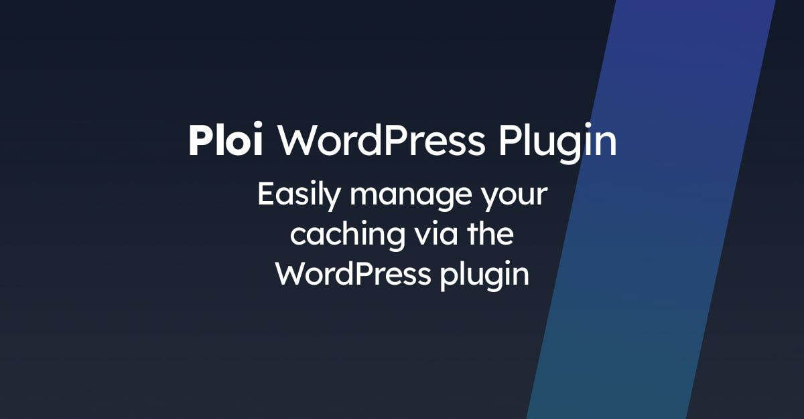

# Ploi WordPress Plugin

This is the source code of the Ploi WordPress plugin. This plugin makes it easy to flush OPcache and FastCGI cache (if enabled).

## Getting started

[Download](https://github.com/ploi/ploi-wordpress-plugin/archive/refs/heads/master.zip) the plugin, and upload it to your WordPress installation.

After installation, you will have to generate a API key in Ploi: https://ploi.io/profile/api-keys and enter this in the
plugin settings. Then you'll be able to select the proper server & site that needs to be attached to your WordPress installation.

## Security notice

While this plugin is an awesome tool to manage your site with, it comes with security vulnerabilities because it is still WordPress.

The plugin uses a cipher to encrypt your API token from ploi.io, this does not guarantee hackers cannot read the key. The installation itself
saves the key encrypted, but the system itself is also possible to decrypt it.

Be **carefully** aware of this fact, make sure to completely protect your WordPress site to prevent hackers from stealing your data.

If in any case it has been hacked, make sure to revoke the Ploi API token in your profile: https://ploi.io/profile/api-keys

We also have a article on how to get started with protecting your Wordpress installation: https://ploi.io/documentation/optimisations/how-do-i-secure-my-wordpress-installation

**Ploi cannot be held responsible for a stolen API key and the consequences of a stolen API key, it is up to you to keep your installation protected.**

## Contributing
PR's to improve this plugin is more than welcome. In case of any big adjustments or breaking changes you might want to discuss
beforehand with the Ploi team to make sure your PR won't get rejected for nothing.

## Authors
* **Giorgos Tsarmpopoulos** - *Initial work* - [tsarbo](https://github.com/tsarbo)
* **Dennis Smink** - *Maintainer* - [cannonb4ll](https://github.com/cannonb4ll)
* **Dieter Jeanty** - *Maintainer* - [Webtica](https://github.com/Webtica)

## License
This project is licensed under the MIT License - see the [LICENSE](https://github.com/ploi-deploy/ploi-wordpress-plugin/blob/master/LICENSE) file for details
